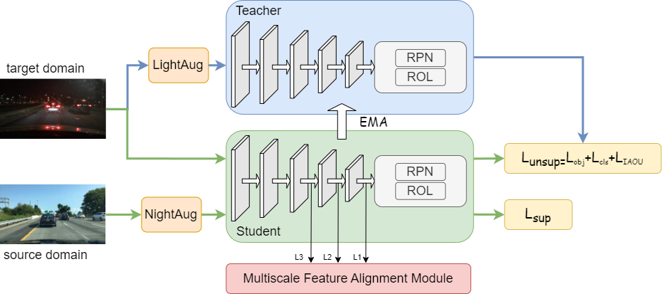

# Improving Low-Light Object Detection via Domain Adaptation and Image Enhancement

**Improving Low-Light Object Detection via Domain Adaptation and Image Enhancement**<br>

These codes are directly related to the current manuscript submitted to The Visual Computer: Improving Low-Light Object Detection via Domain Adaptation and Image Enhancement. <br>

<p align="center">

</p>


# Installation

## Prerequisites

- Python ≥ 3.6
- PyTorch ≥ 1.5 and torchvision that matches the PyTorch installation.
- [Detectron2 == 0.6](https://detectron2.readthedocs.io/en/latest/tutorials/install.html)


## Dataset download
1. Download the datasets (BDD100K / SHIFT)

2. Split dataset into two parts using labels ‘day’ and ‘night’. You can download our split files from [Google Drive](https://drive.google.com/drive/folders/1hcNGL5suCEbDG5Z7OTgrlq_jylE5aKBE?usp=drive_link).

3. Organize the dataset with the following format

```shell
ILOD/
└── datasets/
    └── bdd100k/
        ├── train/ 
            ├── img00001.jpg
            ├──...
        ├── val/ 
            ├── img00003.jpg
            ├──...
        ├── train_day.json
        ├── train_night.json
        ├── val_night.json
    └── shift/
        ├── train/ 
            ├── folder1
            ├──...
        ├── val/ 
            ├── folder1
            ├──...
        ├── train_day.json
        ├── train_night.json
        ├── val_night.json

    
```

# Training

```shell
python train_net.py --num-gpus 3 --config configs/faster_rcnn_R50_bdd100k.yaml OUTPUT_DIR output/bdd100k
```

## Resume the training

```shell
python train_net.py --resume --num-gpus 3 --config configs/faster_rcnn_R50_bdd100k.yaml MODEL.WEIGHTS <your weight>.pth
```

## Evaluation

```shell
python train_net.py --eval-only --config configs/faster_rcnn_R50_bdd100k.yaml MODEL.WEIGHTS <your weight>.pth
```
# Acknowledgements
Code is adapted from [Detectron2](https://github.com/facebookresearch/detectron2) and [2pcnet](https://github.com/mecarill/2pcnet).
